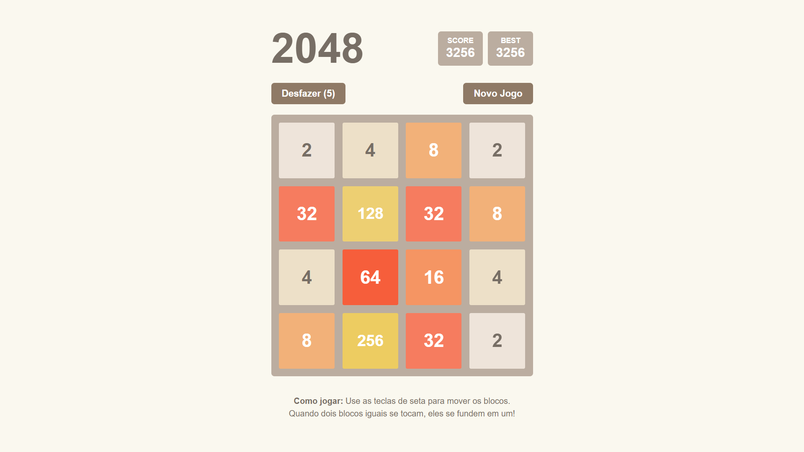

<h1 align="center">🌟 2048 - Jogo Clássico 🌟</h1>

  <strong>Bem-vindo ao repositório 2048</strong>, uma implementação do popular jogo 2048 desenvolvida com HTML, CSS e JavaScript. 🎮 Este projeto oferece uma experiência divertida e desafiadora, com animações suaves e funcionalidades interativas, ideal para jogadores casuais e entusiastas de quebra-cabeças.

  

---

<h2 align="center">📖 Descrição do Projeto</h2>

O **2048** é uma versão digital do clássico jogo de lógica onde o jogador desliza blocos numerados em uma grade 4x4 para combiná-los e alcançar o valor 2048. Inspirado no jogo original de Gabriele Cirulli, este projeto adiciona animações modernas e suporte a controles por toque, tornando-o acessível tanto para desktops quanto para dispositivos móveis.

---

<h2 align="center">🛠️ Funcionalidades</h2>

- ✅ Animações suaves para movimentos e fusões de blocos.
- ✅ Opção de desfazer movimentos (até 5 vezes por jogo).
- ✅ Rastreamento de pontuação com salvamento da melhor pontuação no armazenamento local.
- ✅ Design responsivo para desktops e dispositivos móveis.
- ✅ Suporte a controles por toque para jogabilidade em dispositivos móveis.
- ✅ Opções de novo jogo e continuar após vencer ou perder.

---

<h2 align="center">🎯 Público-Alvo</h2>

O **2048** é ideal para:

- 👾 Jogadores casuais que gostam de desafios de lógica e quebra-cabeças.
- 📱 Usuários de dispositivos móveis que buscam entretenimento portátil.
- 🎓 Estudantes ou profissionais que desejam uma pausa rápida e interativa.

---

<h2 align="center">🏫 Sobre o Desenvolvimento</h2>

Este projeto foi desenvolvido com apoio da Grok da xAI, refletindo um esforço para criar uma solução interativa e educativa. Ele destaca a aplicação prática de tecnologias web para criar experiências de jogo acessíveis e envolventes.

---

<h2 align="center">💻 Tecnologias Utilizadas</h2>

  
  
  

- 🌐 **HTML5 e CSS3**: Estrutura e design da interface com animações.
- ⚡ **JavaScript**: Lógica do jogo e interatividade dinâmica.

---

<h2 align="center">📸 Prévia do Design</h2>

  

---

<h2 align="center">👥 Contribuidores</h2>

Conheça os responsáveis por este projeto!

<ul>
  <li><strong>Yan Fellippe</strong> - Desenvolvedor Fullstack</li>
</ul>

---

<h2 align="center">🤝 Como Contribuir</h2>

Quer ajudar a melhorar o **2048**? Siga os passos abaixo!

1. 🍴 Faça um fork deste repositório.
2. 🌿 Crie uma branch para suas alterações: `git checkout -b minha-contribuicao`
3. 💾 Implemente suas melhorias e faça commit: `git commit -m 'Adicionando minha contribuição'`
4. 🚀 Envie para o repositório remoto: `git push origin minha-contribuicao`
5. 📬 Abra um Pull Request para revisão.

---

<h2 align="center">📧 Contato</h2>

Tem dúvidas, sugestões ou feedback? Entre em contato!

- 📩 **Email**: [yangomesbasilio@gmail.com](mailto:yangomesbasilio@gmail.com)

---

<h2 align="center">ℹ️ Sobre</h2>

O **2048** foi desenvolvido como um projeto pessoal. Este projeto reflete o potencial de soluções simples e acessíveis para entretenimento, sendo uma ótima demonstração de habilidades em desenvolvimento front-end.

---

<h1 align="center">⭐ Obrigado por conhecer o 2048! ⭐</h1>

  Divirta-se jogando e sinta-se à vontade para contribuir para o crescimento deste projeto! 🎮

